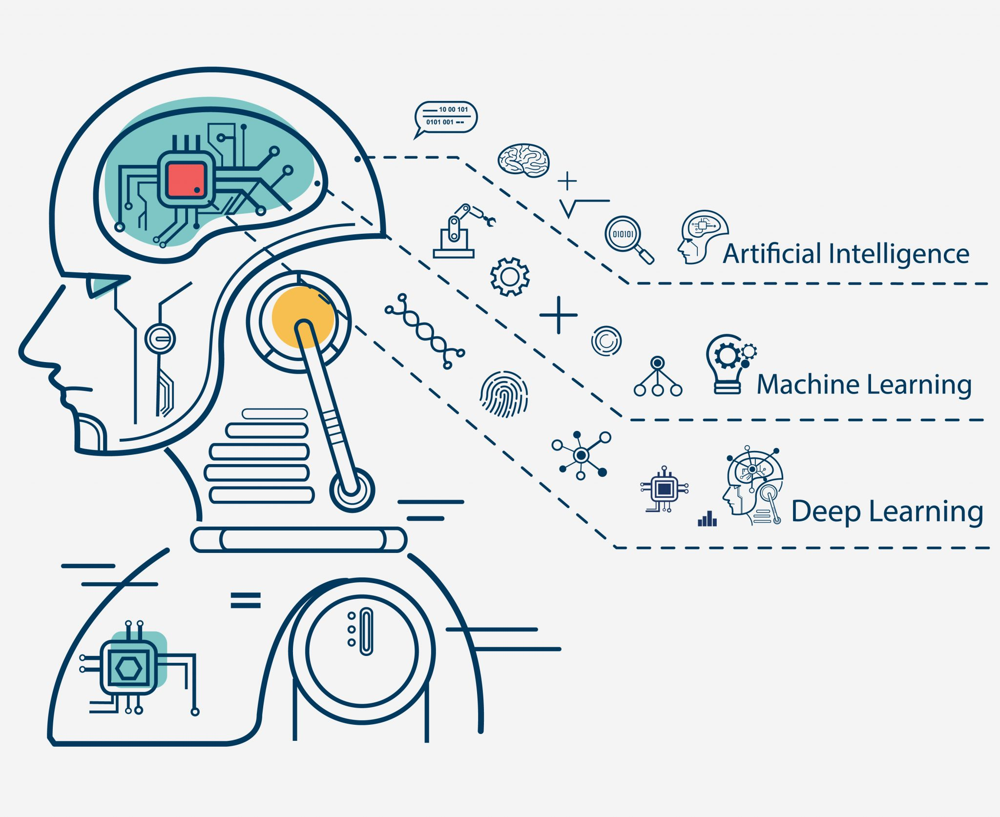

# Introduction to ML and neural network
Within AI Day event organized by School of AI, Algiers, we're gonna talk mainly about ML and how to get into this domain. From data exploration to neural networks, we'll learn how to manipulate data frames using python libraries, implement a linear learning model and how to create our first neural network.

<p align="center">
	
</p>

# Folder Structure
* intro_to_ml.ipynb and neural_networks.ipynb: workshop notebooks.
* data: 
	- you will implement linear regression to predict house pricing (housepricing.csv)
	- build your first neural network to predict diabetes (diabets.csv)


# Requirements

Please install the following tools:

* Anaconda : Check out their website : https://docs.anaconda.com/anaconda/install/
* libraries: conda install pandas numpy matplotlib sklearn

**If you didn't install Anaconda you can still use your regular python and install the needed libraries using pip:**

```pip install pandas numpy matplotlib sklearn```

